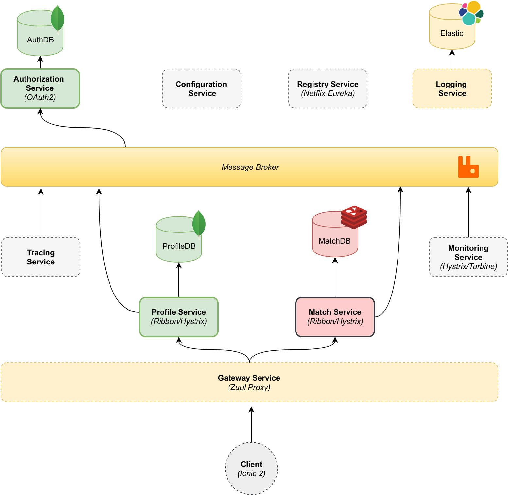
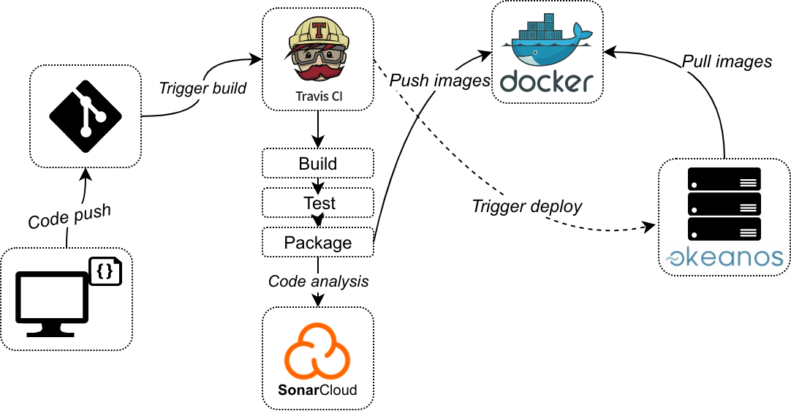

  

# Vento Rest API

A scalable microservice application using [Spring Cloud](https://cloud.spring.io/) targeting athletes by tracking their location during their workout in real-time allowing them to participate together along with others at the same area within a distance limit. 
The application has automatic service discovery mechanisms ([Netflix Eureka](https://github.com/Netflix/eureka)), self-healing in case of failure with Circuit Breakers ([Hystrix](https://github.com/Netflix/Hystrix)), Docker container instance scaling, auto-restarting capability.
The presentation layer consists of rest-endpoints and websockets using Stomp. 
Services communicate internally through message-queues ([RabbitMQ](https://www.rabbitmq.com/)) by propagating messages from one to another.
Data is stored in two types of NoSQL databases, [MongoDB](https://www.mongodb.com/) for client data and [Redis](https://redis.io/) for user geolocation and geospatial queries.
Finally, there is a monitoring system behind collecting metrics and events with ELK stack ([Elastic](https://www.elastic.co/products/elasticsearch), [Logstash](https://www.elastic.co/products/logstash), [Kibana](https://www.elastic.co/products/kibana)).

## Service Diagram

## Default service ports 

| Service| port |
| --- | --- |
| Config | 8888 |
| Registry | 8761 |
| Auth | 3000 |
| Gateway | 80 |
| Profile | 1000 |
| Match | 2000 |
| Monitoring (Hystrix Dashboard) | 8080 |
| Tracing | 9411 |
| RabbitMQ Management | 5672 |
| Logging (Kibana) | 5601 |

## Endpoints

### Profile Service

| HTTP Method | URI | Protected |
| --- | --- | --- |
| GET | /{name} | No |
| GET | /me | Yes |
| PUT | /me | Yes |
| POST | /me/routes | Yes |
| PUT | /me/routes | Yes |
| POST | /me/records | Yes |
| PUT | /me/records | Yes |
| POST | / | No |

### Auth Service

| HTTP Method | URI | Protected |
| --- | --- | --- |
| POST | / | No | 
| GET | /me | Yes | 

### Match Service 

| Websocket | URI |
| --- | --- | 
| Publish | /track/{username} |
| Publish | /request/{username} |
| Subscribe | /around/{username} |
| Subscribe | /topic/requests/{username} |
| Subscribe | /around/me |

## Deploy diagram

